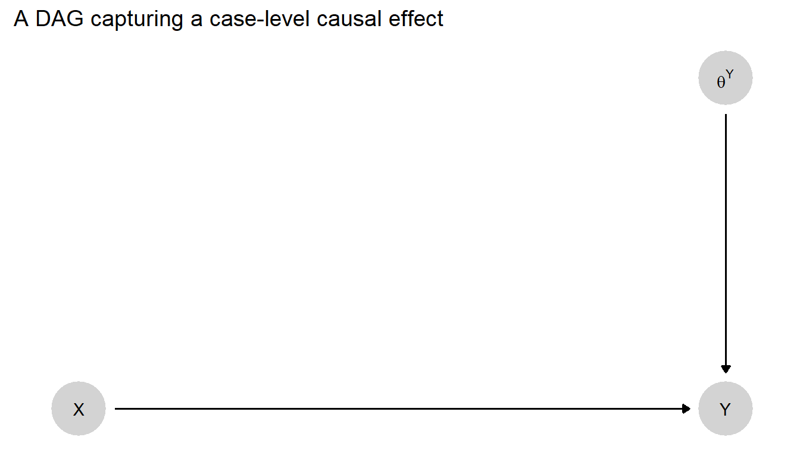
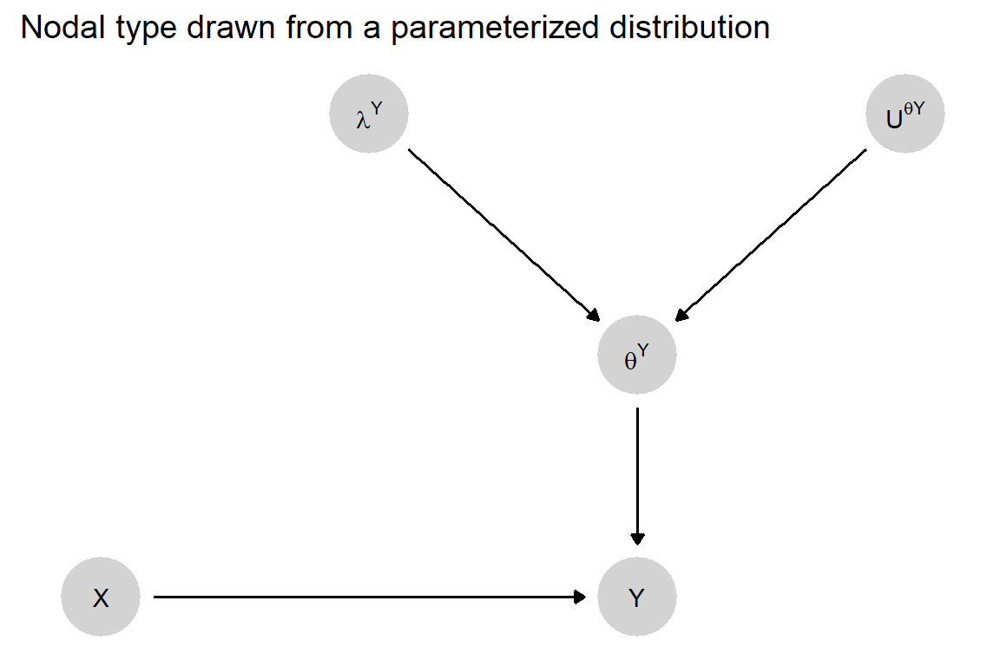

## Antes da aula começar

- Trabalho final
- última aula do curso

## Introdução

- Queries causais: uso de DAGs para estudos de caso e métodos mistos
- Abordagem quantitativa para estudos qualitativos
- Supõe considerar as variáveis como binárias
- Relações causais determinísticas (um caso tem ou não aquele efeito causal)

## Tipos Causais

### Adverso
- Definição: Aqueles que melhorariam se e somente se não recebessem o tratamento.
- Representação: \( \text{Adverso} \rightarrow a \)

### Benéfico
- Definição: Aqueles que melhorariam se e somente se recebessem o tratamento.
- Representação: \( \text{Benéfico} \rightarrow b \)

### Crônico
- Definição: Aqueles que permanecerão doentes, independentemente de receberem ou não o tratamento.
- Representação: \( \text{Crônico} \rightarrow c \)

### Destinado
- Definição: Aqueles que melhorarão, independentemente de receberem ou não o tratamento.
- Representação: \( \text{Destinado} \rightarrow d \)

## Participação Relativa dos Tipos

- Usamos os termos \( \lambda_a \), \( \lambda_b \), \( \lambda_c \), \( \lambda_d \) para denotar a participação relativa desses tipos na população de interesse.

## Tipos Potenciais

### Variável \( Y \)

- Usamos \( \theta^Y \) para capturar o “tipo” da unidade: como \( Y \) responde às suas causas potenciais.
- Adicionamos subscritos para denotar tipos particulares.

### Notação \( \theta^Y_{ij} \)

- \( i \): resultado potencial quando \( X = 0 \)
- \( j \): resultado potencial quando \( X = 1 \)

## Exemplificação dos Tipos

- Com quatro tipos possíveis, utilizamos \( \theta^Y_{ij} \) para representar cada caso específico:
  - \( \theta^Y_{00} \): \( Y \) é 0 quando \( X = 0 \) e 0 quando \( X = 1 \). Aka **c**rônico.
  - \( \theta^Y_{01} \): \( Y \) é 0 quando \( X = 0 \) e 1 quando \( X = 1 \). Aka **b**enéfico
  - \( \theta^Y_{10} \): \( Y \) é 1 quando \( X = 0 \) e 0 quando \( X = 1 \). Aka **a**dverso.
  - \( \theta^Y_{11} \): \( Y \) é 1 quando \( X = 0 \) e 1 quando \( X = 1 \). Aka **d**estinado.


## Tabela dos Tipos Potenciais

```{r, echo=FALSE}
library(knitr)

# Criação da tabela
types <- matrix(c("Y(0) = 1", "Y(0) = 0", "Y(0) = 0", "Y(0) = 1",
                  "Y(1) = 0", "Y(1) = 1", "Y(1) = 0", "Y(1) = 1"),
                nrow = 2, byrow = TRUE,
                dimnames = list(c("X = 0", "X = 1"),
                                c("Tipo a: ($\\theta^Y_{10}$)", "Tipo b: ($\\theta^Y_{01}$)", "Tipo c: ($\\theta^Y_{00})$", "Tipo d: ($\\theta^Y_{11}$)")))

# Exibir a tabela
kable(types, format = "pandoc", align = "c")

```

## Generalizando para N causas

- Em geral, fenômenos sociais são multicausais
- Portanto, precisamos generalizar nossa notação para mais de uma causa.
- Suponha duas causas, $X_1$ e $X_2$, ambas binárias. Temos quatro possibilidades de combinação de valores de $X_1$ e $X_2$.
- Portanto, escreveremos $\theta^Y_{hijk}$ de acordo com a notação abaixo:

\begin{eqnarray}
\theta^Y_{hijk} \left\{\begin{array}{ccc}  Y(0,0) &=& h  \\
Y(1,0) &=& i \\
Y(0,1) &=& j \\
Y(1,1) &=& k
\end{array} \right.
\end{eqnarray}

- O primeiro argumento de $Y(.,.)$ é o valor de $X_1$ e o segundo argumento o valor de $X_2$.
- Por exemplo, $\theta^Y_{0101}$ significa que $Y = 1$ quando $X_1 = 1 e X_2 = 0$ e quando ambos $X_1 = 1$ e $X_2 = 1$. Ou seja, só $X_1$ tem efeito. $\theta^Y_{0011}$ é o tipo em que $Y = 1$ se e somente se $X_2 = 1$.

## Generalizando para N causas - cont

- Aqui, esse modelo captura interações entre variáveis. O tipo $\theta^Y_{0001}$ diz que $X_2$ tem um efeito sobre $Y$ apenas quando $X_1 = 1$.

- Os tipos $\theta^Y_{0001}$ e $\theta^Y_{1000}$ são complementares, isto é, $X_1$ e $X_2$ se complementam. No primeiro tipo, uma variável só tem efeito na presença da outra, no outro caso, só há efeito na ausência das duas (efeito negativo).

- Os tipos $\theta^Y_{0111}$ e $\theta^Y_{1000}$ são substitutos, pois no primeiro caso o efeito causal de $X_2$ só existe quando $X_1 = 0$, e no segundo caso, $X_1$ tem um efeito causal negativo apenas quando $X_2 = 0$.

- Fica claro que múltiplas causas é impraticável, embora logicamente possível.

- Mais de duas categorias também explode o número de combinações (embora logicamente possível).

- Similarmente podemos ampliar o modelo para n causas. E teremos $2^{2^n}$ tipos.

- Nesse framework, causas não precisam ser rivais.

## Modelos de Queries causais

- Efeito Causal Médio, Causas ao nível de casos (case-level causal analysis) e caminhos causais podem ser entendidos como queries (consultas) causais a um modelo.

- Query causal: um algoritmo que recebe um modelo $M$ como entrada e retorna uma quantidade $Q(M)$ como saída.

- Quatro queries causais chave:
1. Efeitos causais ao nível de caso (case-level)
2. Atribuição causal ao nível de caso 
3. Efeitos causais médios (ATE)
4. Caminhos causais

## Efeito causal ao nível do caso

- Muitas perguntas de pesquisa são do tipo: $X$ tem um efeito causal em $Y$ neste caso? Exemplo: Há uma literatura que diz que crises econômicas são importantes para termos impeachment. Portanto, nos perguntar: se houvesse uma crise econômica no Brasil de hoje, Lula sofreria Impeachment?

- Em termos contrafactuais, estamos interessados em saber: se eu pudesse intervir (exogenamente) no valor de $X$, como mudaria o valor de $Y$?

```{r DAG1, echo=FALSE, out.width='50%', fig.align='center'}
library(knitr)

```

## Efeito causal ao nível do caso - cont.

- Aqui, perguntar qual o efeito causal de $X$ é perguntar qual o tipo de $Y$.

- Podemos fazer outras perguntas: Qual a probabilidade de $Y$ ser do tipo $\theta^Y_{01}$, isto é, que $X$ tem um efeito causal positivo sobre $Y$? 
- Podemos perguntar "Qual a probabilidade que $X$ importe para o valor de $Y$? Ou seja, somar as probabilidades de $\theta^Y_{01}$ + $\theta^Y_{10}$.
- Por fim, podemos nos perguntar "Qual o efeito esperado de $X$ sobre $Y$?", ou seja, subtrair a probabilidade $\theta^Y_{01}$ de $\theta^Y_{10}$

## Atribuição causal ao nível do caso

Perguntas de atribuição causal são do tipo: "$X$ de fato causou $Y$?". Continuando com nosso exemplo, perguntaria: "a crise econômica causou o impeachment da Dilma em 2016?".

- Em termos contrafactuais, estamos interessados em saber: *Dado os valores que $X$ e $Y$ de fato assumiram, o valor de $Y$ seria diferente se o valor de $X$ fosse diferente?"

- Parece similar ao anterior, mas é diferente. Aqui estamos falando do degrau 3 na escada de causalidade de Pearl.

## Escada da causalidade de Pearl

- Pearl separou a escada da causalidade em três degraus: associacional, intervencional e contrafactual. Os verbos associados a cada degrau são ver, agir e imaginar.

- Degrau 2 é uma intervenção (a pergunta anterior). Degrau 3 é imaginação (pergunta atual).

- Para entender a diferença, considere o seguinte caso.
Em uma população, tenho 50% dos casos são do tipo **c**rônico, isto é, $\theta^Y_{00}$ e 50% dos casos são do tipo **d**estinado, isto é, $\theta^Y_{11}$. Aqui, o efeito causal médio do tratamento $X$ é zero.

- Em outra população, tenho 50% dos casos do tipo **a**dverso ($\theta^Y_{10}$) e 50% são do tipo benéfico ($\theta^Y_{01}$). Novamente, o efeito causal médio do tratamento é zero, já que os tipos $B$ cancelam o efeito do tipo $A$.

- Mas as perguntas do tipo 3 geram respostas distintas em cada população.
- Na primeira população, como o tratamente não tem efeito para ninguém, então para um caso particular, alguém que recebeu o tratamento teria o mesmo resultado se não tivesse recebido o tratamento.
- Na segunda população, quem recebeu o tratamento $X=1$ e teve um resultado ruim $Y=0$ é do tipo adverso. Portanto, teria um resultado melhor se não recebesse o tratamento.

## Degraus de causalidade (cont.)

- Então, tomando o exemplo anterior a distinção entre efeito causal ao nível do caso (pergunta 1) e atribuição causal ao nível do caso (pergunta 2) pode ser traduzido em:

1. Qual a probabilidade do meu caso ser do tipo $\theta^Y_{01}$? Se meu caso for da população 1, a resposta é zero. Se for da população 2, a resposta (a priori) é 50%. Se eu observar $X=1$ e $Y=0$, ou é do tipo adverso (população 2) ou do tipo crônico (população 1) e, portanto, continuo com a mesma probabilidade 50% de ter efeito causal positivo e 50% de probabilidade de não ter efeito causal.

2. Dado que eu observei um certo valor de $X$ (digamos, $X=1$) e o valor de $Y$ (digamos, $Y = 0$), qual seria o valor de $Y$ se $X=0$? Com 50% de chance, $Y$ seria $1$ (tipo adverso) e com 50% de chance $Y=0$ (tipo crônico).

- Veja que com um experimento, vou recuperar o efeito causal médio, mas não o efeito 

## Efeito Causal Médio

- Podemos também fazer perguntas sobre efeitos causais médios em populações.
- Para tratamentos binários e respostas binárias, é a diferença entre a proporção de casos em que o efeito é benéfico menos a proporção de casos em que o efeito é negativo: $\lambda_b - \lambda_a$ ou $\lambda^Y_{01} - \lambda^Y_{10}$

```{r DAG2, echo=FALSE, out.width='50%', fig.align='center'}
library(knitr)

```

- Aqui, ${U ^ \theta}^Y$ representa um sorteio aleatório do caso a partir da distribuição de probabilidade dos tipos dada por $\lambda^Y$.


## Caminhos causais

- Suponha que tenho voas evidências de de $X$ causou $Y$ em um dado caso. Porém, será que foi via $M$, um mediador?

- Em notação de resultados potenciais, seria: $Y(X=x, M = M(X=1)) > Y(X = x, M = M(X=0))$.

- Ou seja, haveria um aumento no valor de $Y$ se $M$ mudasse como se fosse devido a uma mudança em $X$, mas sem uma mudança real em $X$?


## Causas de fato/reais/atuais (actual)

- Nossa defininção de causalidade contrafactual (resultados potenciais) gera o seguinte "paradoxo":
- Digamos que Suzy e Bob jogam uma pedra em uma garrafa. A peda de Suzy atinge a garrafa primeiro, quebrando a garrafa. Porém, se a pedra de Suzy não tivesse atingido a garrafa, Bob teria acertado a garrafa e ela teria quebrado.
- Portanto, o "tratamento" Suzy jogar pedra não é um efeito causal da garrafa quebrada, pois o resultado potencial é o mesmo quer ela jogue a garrafa ou não.

## Causas de fato/atuais (actual) - cont.

- Porém, óbvio que foi a pedra de Suzy que quebrou a garrafa.
- Chamamos de causas de fato (ou atuais) este tipo de causa, cujo efeito depende de condicionarmos em outra variável (no caso, a pedra de Bob não ter atingido a garrafa antes).
- Nós podemos usar o modelo de queries causais para responder a esse tipo de pergunta e diferenciar causais atuais (de fato) de causas no sentido contrafactual.
- Causas de fato existem quando tenho duas (ou mais) causas suficientes para um resultado, mas uma impede o efeito da outra.
- Não vou entrar aqui nesse detalhe. Consutem o apêndice do cap. 4 do livro para saber mais sobre esse caso.

## Mapeando Queries a tipos causais

- Na prática, podemos utilizar o pacote CausalQueries para responder nossas queries.
- As queries envolvem alguns parâmetros:
1. Para uma variável $x_1$ qualquer, ela pode assumir valores $\{-1, 0, 1\}$, em que $-1$ signifca "não controlada por essa variável", $0$ significa que $x_1 = 0$ exogenamente (do operation) e analogamente $1$ é  $x_1 = 1$ exogenamente.
- Posso ter $n$ variáveis, dada por $x = (x_1, x_2, ..., x_n)$.
- O valor $V_j(pa_j, \theta_t)$ é o valor que o nó $j$ assume dado os valores dos parentes de $j$, $pa_j$ e o tipo causal $\theta_t$.
- Como todas as variáveis são binárias, é possível identificar todas as possobilidade de um nós responder aos valores dos seus parentes (isto é, determinar o tipo do nó $Y$).

## Mapeando Queries a tipos causais - cont.

- Exemplo, para nós $X$ e $Y$.
- Q_1: $1(Y(X=1)=1))$ pergunta se ao setar $X=1$, obtenho $Y=1$. Ou seja, qual o Valor do $Y$, dado seu tipo causal e $X=1$ exogenamente.
Q_2: $1(Y(X=1)=1) \& 1(Y(X=0)=0))$ pergunta se é simultaneamente verdade que $Y=1$ quando $X=1$ e $Y=0$ quando $X=0$. Em outras palavras, se é um tipo causal benéfico.

## Declarando modelos no CausalQueries

```{r CausalQueries1, echo=TRUE, message=FALSE, warning=FALSE}

library(CausalQueries)

model <- make_model("X -> M -> Y <- X")

# Equivalente

model1 <- make_model("X -> M -> Y; X -> Y")
```

- Podemos plotar os DAGs, para verificar que fizemos corretamente:

## plot 1
```{r CausalQueries plot1, echo=TRUE}
plot(model)
```

## plot 2
```{r CausalQueries plot2, echo=TRUE}
plot(model1)
```

## Declarando modelos no CausalQueries - cont

```{r CausalQueries3, echo=TRUE, message=FALSE, warning=FALSE}
library(knitr)

my_model <- make_model("X -> Y")
df <- my_model$parameters_df

kable(df)
```

- vinhetas: https://ftp.yz.yamagata-u.ac.jp/pub/cran/web/packages/CausalQueries/index.html

## Caso aplicado

- Boix (1999) apresenta uma teoria influente sobre a escolha de sistemas eleitorais e um teste quantitativo da teoria.
- Em resumo, Boix teoriza que as preferências dos partidos governantes entre regras de pluralidade e representação proporcional (RP) dependem da ameaça dos partidos desafiantes sob as regras vigentes.

## Preferências dos Partidos

- A presença de um partido de oposição forte, juntamente com a falha de coordenação entre os partidos governantes, cria fortes incentivos para que os governos mudem da pluralidade para a RP.
- Boix foca em um conjunto de 22 casos europeus do período entre guerras.
- Nesse contexto—com a extensão do sufrágio universal permitindo o surgimento de desafiantes socialistas—a teoria implica que os partidos governantes deveriam ter mais probabilidade de mudar para RP onde a esquerda era eleitoralmente forte e a direita era fragmentada.

## Teoria de Boix (1999)

- **Hipótese Principal**: Governos são mais propensos a adotar RP quando enfrentam uma oposição forte e uma divisão entre partidos de direita.
- **Contexto Histórico**: Extensão do sufrágio universal e ascensão de desafiantes socialistas no período entre guerras na Europa.

## Hipóteses Testadas

- **Força da Esquerda**: Quanto mais forte a esquerda eleitoralmente, maior a probabilidade de mudança para RP.
- **Divisão da Direita**: Quanto mais fragmentada a direita, maior a probabilidade de mudança para RP.
- **Interação**: A combinação de uma esquerda forte e uma direita fragmentada aumenta significativamente a probabilidade de mudança para RP.

## Resultados

- A regressão mostra uma interação negativa significativa entre a força da esquerda e a divisão da direita.
- **Conclusão**: Resultados consistentes com a teoria de Boix sobre a escolha de sistemas eleitorais.

## DAG do modelo de Boix

```{r setup, include=FALSE}
# Carregando o pacote necessário
library(dagitty)
library(ggdag)

# Definindo o DAG
dag_boix <- dagitty('
dag {
  U [label="Variável Não Observada"]
  E [label="Força da Esquerda"]
  D [label="Divisão da Direita"]
  PR [label="Representação Proporcional"]
  
  E -> PR
  D -> PR
  U -> E
  U -> D
  U -> PR
}
')

# Plotando o DAG
ggdag(dag_boix) + 
  theme_dag()
```

- Um modelo com três causas binárias possui $2^{2^3} = 256$ tipos. Vamos usar o pacote CausalQueries com duas causas binárias para ficarmos com 16 tipos.

##

```{r causal-queries, include=TRUE, eval=FALSE}

library(CausalQueries)
# Steps 1 and 2 
# We define a model with three binary nodes and 
# specified edges between them:
model <- make_model("E -> Y; D -> Y")

```